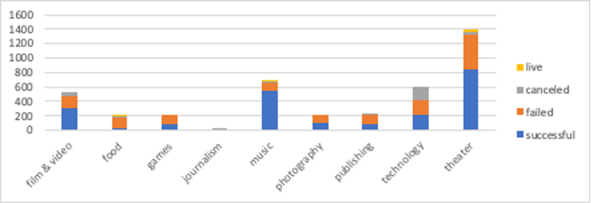
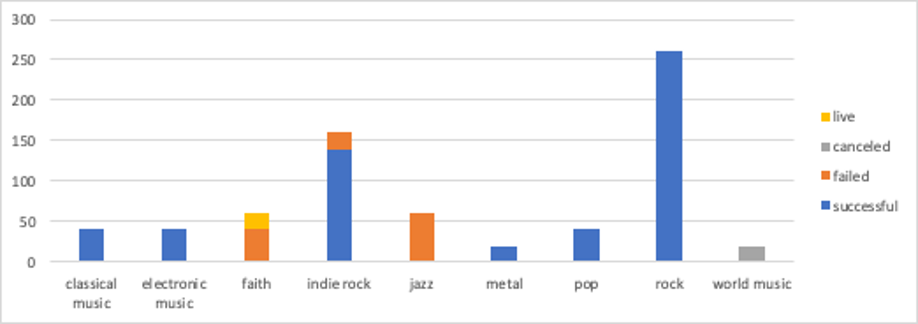
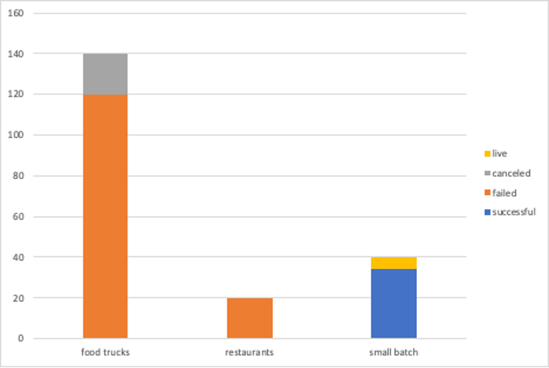
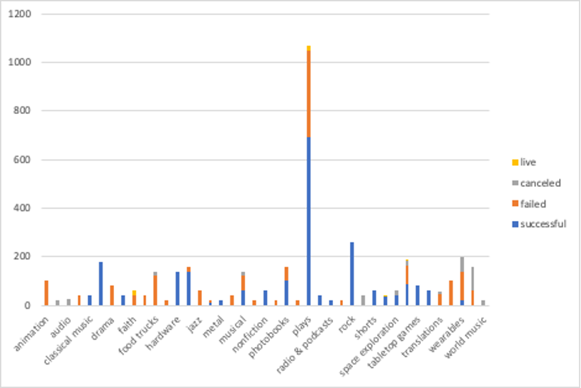

# Kickstarter analysis using Excel

Kickstarter – is a crowdfunding service that launched more than 300,000 projects and raised over $2 billion.
For this project, I organized and analyzed a selected database of 4,000 projects from launched campaigns on Kickstarter.
---

1.	Given the provided data, what are three conclusions I can draw about Kickstarter campaigns?
* From the Pivot_Table_1 tab I created, it is evident that compared to others,
    - “Theater”,
    - “Music” and
    - “Film & Video” 
categories had more successful launched campaigns,

where the “Music” category was the most successful in all the countries one with 540 successful (120 failed) out of total 700 launches.

and the least successful campaigns were in the “Food” category with 140 failed campaigns (34 successful) out of total 200.

* Analyzing the information on a sub-category level (Pivot_Table_2), I can see that 

    -	within the successful “Music” category:
        + “classical music”, 
        + “electronic music”, 
        + “metal”, 
        + “pop”, 
        + “rock” subcategories had 100% success, 
    
    the “jazz” subcategory failed all 60 out of its launched campaigns and 

    the “faith” subcategory had 40 failed campaigns with another 20 still live. If previous performance is any indication of past success, I would expect these 20 faith campaigns to also fail.
    

    - from the least successful “Food” category:

        + “restaurants” subcategory was 100% failed and 

        + “food trucks” subcategory was failed with 120 campaigns out of 140 (20 campaigns are still live). Again, if previous performance is any indication, I would expect these 20 live 'food trucks' campaigns to also fail. 

        + the “Small batch” subcategory showed 34 successful campaigns out of 40 (6 are live).
        

    -	by analyzing all subcategories, I can see that:
        100% success in launches had subcategories: 
        + “classical music”,
        + “documentary”, 
        + “electronic music”, 
        + “hardware”, 
        + “metal”, 
        + “nonfiction”, 
        + “pop”, 
        + “radio & podcasts”, 
        + “rock”, 
        + “shorts”, 
        + “tabletop games”, 
        + “television”

        100% failed campaigns had subcategories:
        + “animation”, 
        + “children’s books”, 
        + “drama”, 
        + “fiction”, 
        + “gadgets”, 
        + “jazz”, 
        + “mobile games”, 
        + “nature”, 
        + “people”, 
        + “places”, 
        + “restaurants”, 
        + “video games” 
        

    

