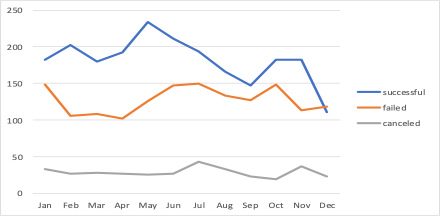
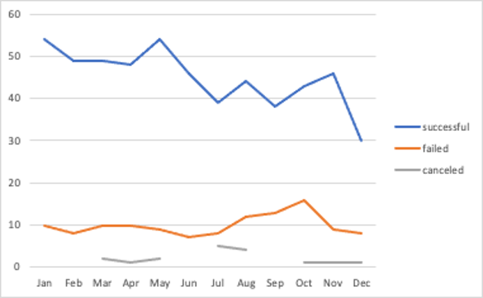
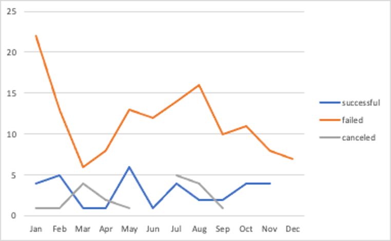

# Kickstarter analysis using Excel

Kickstarter – is a crowdfunding service that launched more than 300,000 projects and raised over $2 billion.
For this project, I organized and analyzed a selected database of 4,000 projects from launched campaigns on Kickstarter.
---

1.	Given the provided data, what are three conclusions I can draw about Kickstarter campaigns?
* From the Pivot_Table_1 tab I created, it is evident that compared to others,
    - “Theater”,
    - “Music” and
    - “Film & Video” 
categories had more successful launched campaigns,

where the “Music” category was the most successful in all the countries one with 540 successful (120 failed) out of total 700 launches.

and the least successful campaigns were in the “Food” category with 140 failed campaigns (34 successful) out of total 200.

* Analyzing the information on a sub-category level (Pivot_Table_2), I can see that 

    -	within the successful “Music” category:
        + “classical music”, 
        + “electronic music”, 
        + “metal”, 
        + “pop”, 
        + “rock” subcategories had 100% success, 
    
    the “jazz” subcategory failed all 60 out of its launched campaigns and 

    the “faith” subcategory had 40 failed campaigns with another 20 still live. If previous performance is any indication of past success, I would expect these 20 faith campaigns to also fail.
    

    - from the least successful “Food” category:

        + “restaurants” subcategory was 100% failed and 

        + “food trucks” subcategory was failed with 120 campaigns out of 140 (20 campaigns are still live). Again, if previous performance is any indication, I would expect these 20 live 'food trucks' campaigns to also fail. 

        + the “Small batch” subcategory showed 34 successful campaigns out of 40 (6 are live).
        

    -	by analyzing all subcategories, I can see that:
        
        100% success in launches had subcategories: 
        + “classical music”,
        + “documentary”, 
        + “electronic music”, 
        + “hardware”, 
        + “metal”, 
        + “nonfiction”, 
        + “pop”, 
        + “radio & podcasts”, 
        + “rock”, 
        + “shorts”, 
        + “tabletop games”, 
        + “television”

        100% failed campaigns had subcategories:
        + “animation”, 
        + “children’s books”, 
        + “drama”, 
        + “fiction”, 
        + “gadgets”, 
        + “jazz”, 
        + “mobile games”, 
        + “nature”, 
        + “people”, 
        + “places”, 
        + “restaurants”, 
        + “video games” 
        

* Analyzing the campaigns by the month (Pivot_Table_3),
    -   I can see that campaigns launched in the month of May had the highest count of successful campaigns during the year, at 234. The month with the highest count of failed campaigns were July (150), closely followed by January (149), and October (149).
    

    -   looking at the most and least successful categories (“Music” and “Food”),
        + I can see that for “Music”:
            + the most successful months were January and May (54 successful campaigns each)
            + the least successful month was October with 16 failed campaigns
            

        + for “Food” category:
            + the most successful month was May, with 6 successful campaigns
            + the least successful month was January, with 22 failed campaigns
            
            
        Across the various categories, it seems that campaigns launched in the month of May had the most success. 

1. What are some limitations of this dataset?

When looking at the "state" column, there are 4 different types of campaigns: campaigns that were successful, failed, canceled, or is currently live. The "canceled" category raises some questions, because it is not determined why those campaigns were canceled. Would cancellation mean a failure because the campaign organizer lost determination, or perhaps a success because the organizer was able to meet their financial goals with donations outside of Kickstarter? Additional information would be needed to better analyze this data.

The launch and deadline dates provided were unix timestamps and not very user friendly. Providing the dates in a standard MM/DD/YYYY format would have been more straightforward and avoid additional calculations. 

The category and sub-category would ideally be separated, and we wouldn't have to perform additional work to separate those using the "/" sign. The situation would have been more complex if the "/" sign wasn't used consistently to separate the categories and sub-categories. 

Individual donation-level data would add a new perspective and complexity to the results, since we could then determine if the campaigns were successful because of a few individuals' large donations, or a 'team-effort' approach with most of the donations falling within a small range.

    

        

    

